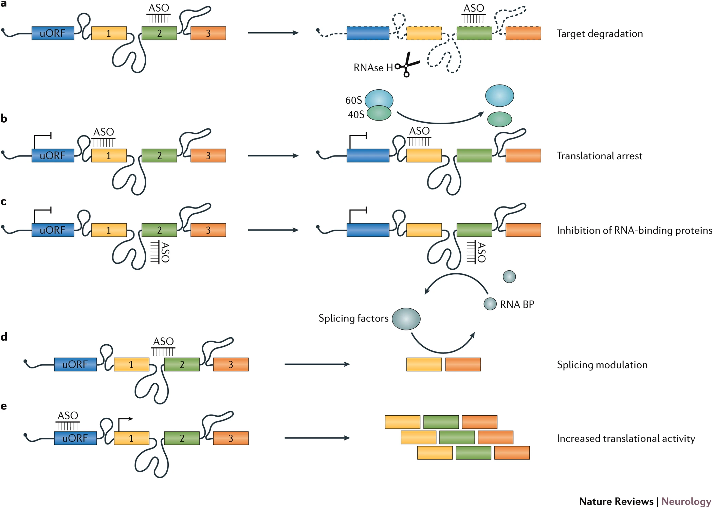

# Antisense oligonucleotide (ASO) off-target finder

ASO-off-finder is a program that finds target and potential off-target sites in the FASTA sequence for input antisense oligonucleotide (ASO) sequences.

# Table of Content

* [Students](#student)
* [Program overview](#overview)
* [Thinkabouts](#intro)
  * [What is the problem to solve?](#intro2)
  * [Why is the problem biologically important?](#intro3)
* [Update history](#history)
* [Algorithm outline](#outline)
* [Benchmark test](#benchmark)

# Students

* 김보근
* 박연수

# Program overview

* Input: target RNA sequence and oligonucleotide sequence (FASTA format)
* Output: target and off-target site coordinate, the number of mismatches in the alignment
* Options: # of allowed mismatches/indels

# Thinkabouts

## What is the problem to solve?

Finding target and off-target site of antisense oligonucleotides.

### What is Antisense oligonucleotide (ASO)?

Antisense oligonucleotide (ASO) is a short, synthetic, single-stranded oligonucleotide. ASOs are intended to bind to RNA (coding or non-coding) molecules with complementary sequences.[^1]
[^1]: [Rinaldi, C., & Wood, M. J. (2018). Antisense oligonucleotides: the next frontier for treatment of neurological disorders. Nature Reviews Neurology, 14(1), 9-21.](https://doi.org/10.1038/nrneurol.2017.148)

By this method, ASOs can modify protein expression or activity of RNAs through several different methods[^1]:
* Target RNA degradation by RNAse H
* Translational arrest
* Inhibit RNA-binding proteins
* RNA splicing modulation
* Increased translational activity

### Different types of standard ASOs

**1\. Gapmer ASO**

Gapmer ASOs have modifications in the phosphate backbone to support RNAse H activity and in the sugar (ribose) ring for higher affinity (e.g. LNA).

Modified nucleotides are only present in the wing of ASOs. Normal nucleotides are present about 10 bases in the central region. Target RNA sequence is cleaved by RNAse H.[^2]

[^2]: [DeVos, S. L., & Miller, T. M. (2013). Antisense oligonucleotides: treating neurodegeneration at the level of RNA. Neurotherapeutics, 10(3), 486-497.](https://doi.org/10.1007/s13311-013-0194-5)

**2\. Splice-switching ASO**

Splice-switching ASOs does not use RNAse H-mediated cleavage of target RNAs. Instead, it sterically blocks the target RNA and regulate pre-mRNA splicing and repairing of defective RNA.[^3]

[^3]: [Havens, M. A., & Hastings, M. L. (2016). Splice-switching antisense oligonucleotides as therapeutic drugs. Nucleic acids research, 44(14), 6549-6563.](https://doi.org/10.1093/nar/gkw533)

## Why is the problem biologically important?
### ASO therapy

ASO can be used to inhibit RNA with specific sequences, which leads to the fact that ASOs could be helpful to treat diseases resulting from single mutant proteins. Several ASO therapies are already approved by FDA for rare genetic diseases:
* Kynamro - Familial hypercholesterolemia
* Tegsedi - Hereditary ATTR amyloidosis
* Exondys 51 - Duchenne muscular dystrophy
* Spinraza - Spinal muscular atrophy

### Why find ASO off-target sites?

Specific ASO binding to the target RNA sequence is needed for high selectivity. However, there is a chance that ASO might bind to off-target RNA molecules that have similar sequences to the original target RNA. This off-target binding of ASOs might cause unintended toxicity.

Also, animal studies cannot be used for off-target finding of ASO applied to humans because of diiference in the genome sequence between.

Thus, in silico analysis using the human RNA database followed by in vitro expression analysis using human cells are essential.

# Update history
## ASO-off-finder v1.0 (2021/11/17)
* First version of ASO-off-finder
* Uses dynamic programming for approximate sequence alignment. [Description slides from Cousera lecture](./supplement/Dynamic_programming.pdf)
* Jupyter notebook file of ASO-off-finder could be found in [v1.0 folder](./v1.0/aso_off_target.ipynb).

## ASO-off-finder v1.1 (2021/12/01)
* Shorter run time using CPU multiprocessing by implementing `concurrent.futures` module
* Input multiple RNA/ASO sequences by FASTA format files
* Human spliced/pre-spliced mRNA sequences can be downloaded from [D3G database](https://d3g.riken.jp/release/18.04/)

# Algorithm outline

* 

Problem | Query | Reference
---- | ---- | ----
Read alignment problem | Sequenced reads | Reference genome
ASO off-target finder | ASO sequence | Target RNA sequence database

* Finding ASO off-target sites is similar to the read alignment problem.
* Apply dynamic programming for approxiamte alignment for matching ASO sequence to target sequences

# Benchmark test

